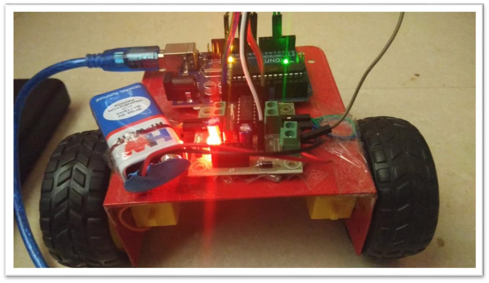
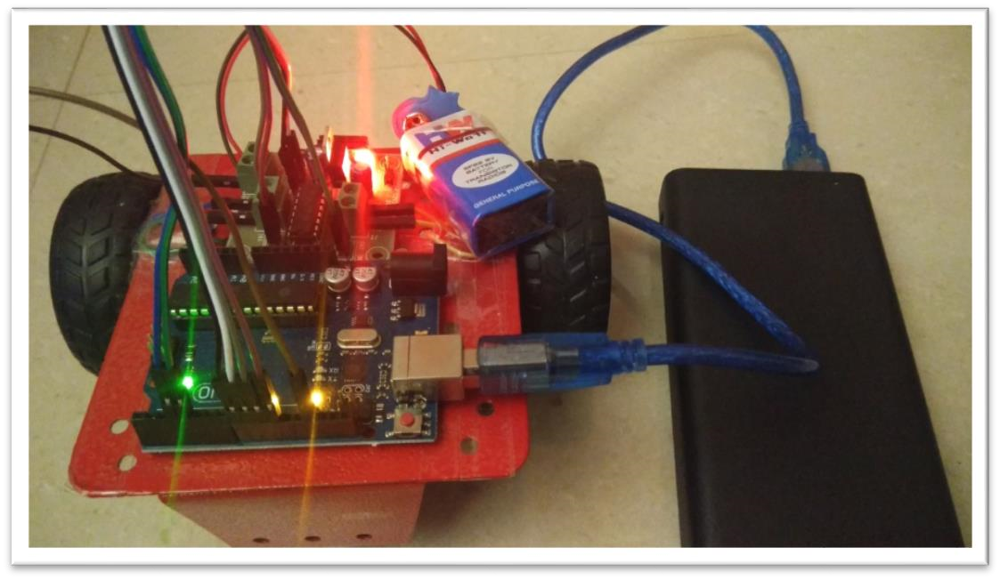
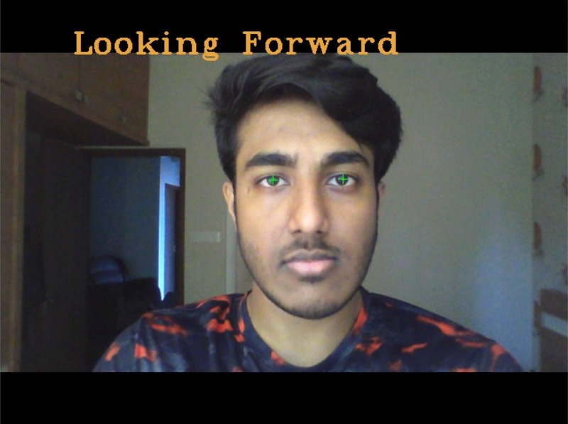
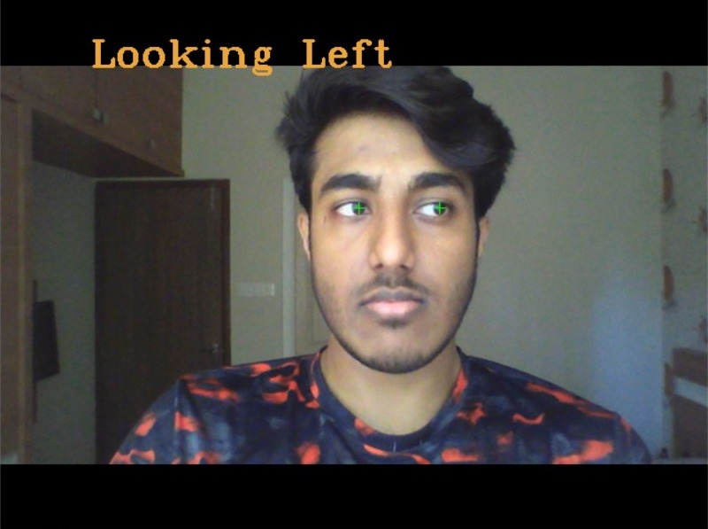
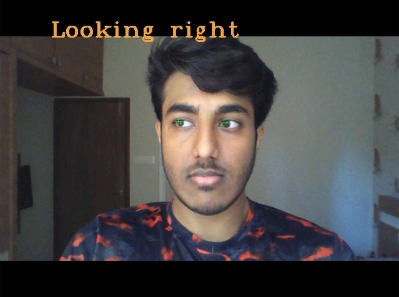
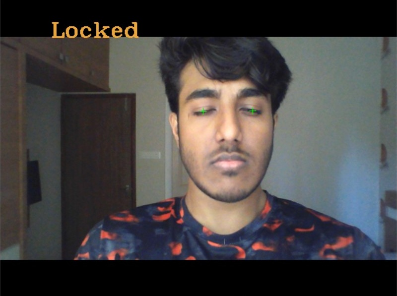
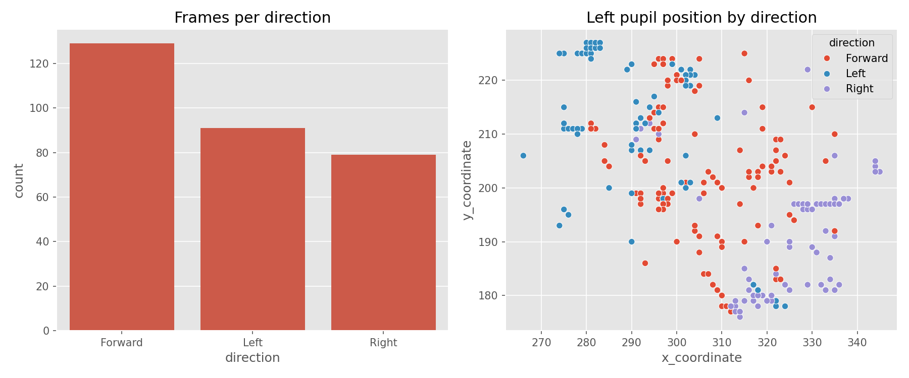

# Eye Controlled Robot

Webcam eye-direction tracking that drives a two-wheeled robot, built as an
assistive-mobility prototype for users with limited motor control. The
tracker classifies each frame as **left**, **right**, **forward** or
**blink**, and forwards a single-character command over serial to an
Arduino Uno driving an L293D motor controller.



## How it works

1. `dlib.get_frontal_face_detector` finds the face in each webcam frame.
2. A 68-point shape predictor locates the eye landmarks.
3. Each eye is masked, cropped, and binarised. The threshold is calibrated
   per webcam over the first 20 frames by sweeping values and picking the
   one that makes the iris cover roughly 48% of the eye surface.
4. The largest contour's centroid is taken as the pupil.
5. The mean horizontal pupil ratio across both eyes gives the direction.
   Eye width over eye height gives the blink signal.
6. Twenty consecutive blink frames toggle a lock, so the robot ignores
   input until the user blinks again to release it.

| Signal | Command | Motors |
| --- | --- | --- |
| Looking forward | `f` | both forward |
| Looking right | `r` | left forward, right stopped |
| Looking left | `l` | left stopped, right forward |
| Blink | `s` | both stopped |

## Setup

Requires Python 3.10 to 3.14 and [uv](https://docs.astral.sh/uv/). The range
is set by `dlib-bin`, which ships prebuilt wheels for those versions and has
no source distribution, so no C++ compiler is needed on any platform.

```bash
git clone https://github.com/anurag-bg-neu/eye-controlled-robot.git
cd eye-controlled-robot
uv sync
uv run scripts/fetch_models.py
```

`fetch_models.py` pulls dlib's stock 68-point shape predictor into `models/`
from dlib.net, decompresses it, and verifies its SHA-256. Model weights are
fetched rather than committed, so the repo stays at a few megabytes instead of
a hundred. If `models/sp.dat` is already there the script is a no-op.

### Models

| File | Landmarks | Size | Source |
| --- | --- | --- | --- |
| `sp.dat` | 68 | 96 MB | dlib's stock `shape_predictor_68_face_landmarks`, fetched by the script |
| `fl68.dat` | 68 | 32 MB | Trained during the capstone. Not distributed, see below |

Both expose the 68-point layout, so both provide the eye landmarks 36 to 47 that
`eye_tracking` indexes. Only `sp.dat` is fetched by the script; `fl68.dat` is not
published anywhere, so `--model models/fl68.dat` works only if you already hold a
copy and drop it into `models/` yourself. Two further models were trained during
the project, `ep.dat` (12 landmarks) and `ep1.dat` (40 landmarks). Neither is
usable here: they renumber the landmarks, so indices 36 to 47 do not exist in
them.

Verify the model loads and tracks before going further:

```bash
uv run scripts/landmark_check.py
```

## Usage

Tracking only, no hardware attached:

```bash
uv run main.py
```

Driving the robot, logging the session:

```bash
uv run main.py --port COM4 --log data/my-session.csv
```

| Flag | Default | Purpose |
| --- | --- | --- |
| `--camera` | `0` | webcam index |
| `--port` | none | serial port, e.g. `COM4` or `/dev/ttyUSB0` |
| `--baud` | `9600` | must match the Arduino sketch |
| `--log` | none | append the session to a CSV |
| `--model` | `models/sp.dat` | shape predictor to load |

Run against the custom model instead of the stock one, if you have it locally:

```bash
uv run main.py --model models/fl68.dat
```

Press `Esc` to quit.

Plot a logged session (needs the `plots` extra):

```bash
uv sync --extra plots
uv run scripts/plot_session.py data/sample_session.csv
```

## Hardware

Flash `arduino/eye_controlled_robot/eye_controlled_robot.ino` to an Arduino
Uno, then wire the L293D as follows.

| Signal | Arduino pin |
| --- | --- |
| `MOT1F` | D4 |
| `MOT1R` | D3 |
| `MOT2F` | D11 |
| `MOT2R` | D10 |

The driver is powered from a 9V battery; the Uno runs off USB.



## Demo

| Forward | Left | Right | Blink / locked |
| --- | --- | --- | --- |
|  |  |  |  |

Direction counts and left-pupil scatter from `data/sample_session.csv`. The
left and right clusters separate cleanly along the x axis, which is the
signal the classifier keys on.



## Layout

```
eye_tracking/     tracking library: detection, isolation, thresholding, pupil location
main.py           capture loop and serial bridge
scripts/          model download, landmark check, shape-predictor training, plotting
arduino/          Uno sketch for the L293D motor driver
.github/          CI workflow
models/           shape predictors land here, not tracked in git
data/             sample logged session
assets/           demo screenshots and hardware photos
docs/             capstone report and presentation, not tracked in git
```

## Known limits

- Single face only; the first detection in the frame wins.
- Thresholds `RIGHT_RATIO` and `LEFT_RATIO` in `eye_tracking/eye_tracking.py`
  were tuned on one webcam under indoor lighting and will need adjusting
  elsewhere.
- Calibration runs once at startup, so a large lighting change mid-session
  degrades pupil detection until restart.
- Vertical gaze is not classified, so the robot cannot reverse.

## Credits

The `eye_tracking` package is derived from
[GazeTracking](https://github.com/antoinelame/GazeTracking), used under the MIT
licence. The direction thresholds, the blink-to-lock behaviour, the serial
bridge, and the session logging are additions; upstream classifies gaze but
drives nothing.

The default landmark model is dlib's stock
`shape_predictor_68_face_landmarks.dat`, unmodified. `fl68.dat` is a 68-point
predictor trained during the capstone and is not distributed here.
`scripts/train_shape_predictor.py` is the training script transcribed from the
capstone report; it writes `models/custom_sp.dat` and needs an annotation XML
that this repo does not carry, so it does not reproduce `fl68.dat` as-is.

Originally built as a B.Tech capstone project at VIT Vellore, 2020.

## Licence

MIT. See [LICENSE](LICENSE).
